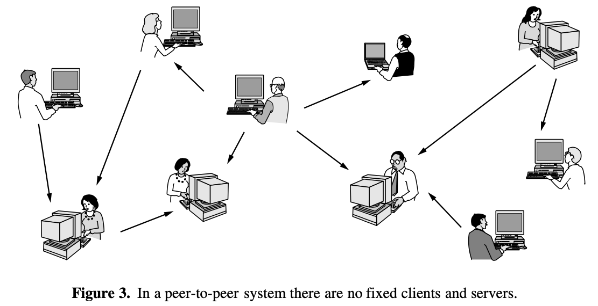

# Introduction

- [Introduction](#introduction)
  - [Uses of Computer Networks](#uses-of-computer-networks)
    - [Business Applications](#business-applications)
    - [Home Applications](#home-applications)
    - [Mobile Users](#mobile-users)
    - [Social Issues](#social-issues)
  - [Network Hardware](#network-hardware)
    - [Personal Area Networks (PANs)](#personal-area-networks-pans)
    - [Local Area Networks (LAN)](#local-area-networks-lan)
    - [Metropolitan Area Networks:](#metropolitan-area-networks)
    - [Wide Area Networks](#wide-area-networks)
    - [Internetworks](#internetworks)
  - [Network Software](#network-software)
    - [Protocol Hierarchies](#protocol-hierarchies)

- **Definition of computer network:** a collection of autonomous computers interconnected by a single technology
- **distributed system vs. computer networks**: 
  - distributed system: a collection of independent computers appears to its user as a single coherent system
  - **middleware**: a layer of software on top of the OS responsible for implementing this model
  
## Uses of Computer Networks
### Business Applications
- the issue here is resource sharing; make things available to anyone on the network without regard to the physical location
- VPN (Virtual Private Networks)
- **client-server model:** join individual networks at different sites (of a company) into one extended network.
  - e.g. Web Application: server generates Web pages based on its db in response to the client requests

### Home Applications
- provides home users with connectivity to remote computers
- peer to peer: 
  - BitTorrent: each user maintains his own db locally and provides a list of other nearby people who are members of the system. 
  - email is inherently peer to peer
- services:
  - social media
  - wiki: collaborative Web site that the members of a community edit
  - e-commerce: 1/3 of the network
    1. B2C: business2consumer: ordering books online
    2. B2B: car manufacturer ordering tires from supplier
    3. G2C: gov distributing tax forms electronically
    4. C2C: second-hand products
    5. P2P: peer to peer
  - entertainment
  - ubiquitous computing: in which computing is embedded into everyday life
  
### Mobile Users
- once again, people want to stay connect
  - cellular connection
  - wireless hotspots
  - wireless networking and mobile computing are not identical concepts: mobile->portable devices; wireless: wireless connection

### Social Issues
- network neutrality
- DMCA takedown notices (Digital Millennium Copyright Act)

## Network Hardware
> turn our attention from the applications and social aspects of networking (the dessert) to the technical issues involved in network design (the spinach). 

There is no generally accepted taxonomy into which all computer networks fit, but 2 dimensions stand out as important:
1. transmission technology:
    - broadcast: the communication channel is shared by all the machines on the network; packets sent by any machine are received by all the others. **An address field within each packet specifies the intended recipient.** Upon receiving a packet, a machine checks the address field. If the packet is intended for th receiving machine, that machine processes the packets, otherwise ignores it.
    - broadcasting: using a special code, the packet can be transmitted to all machines
    - multicasting: transmission to a subset of the machines

    - point-to-point: connects individual pairs of machines; To go from the source to the destination on a network made up of point-to-point links, short messages, called packets in certain context, may have to first visit one or more intermediate machines. Often multiple route, of different lengths, are possible, so finding good ones is important ni point-to-point networks.
      - unicasting: point0to-point transmission with exactly one sender and exactly one receiver

2. scale:
    - internetwork: the connection of two or more networks

### Personal Area Networks (PANs)
- let devices communicate over the range of a person. A common example is a wireless network that connects a computer with its peripherals.

- master-slave paradigm: Bluetooth

### Local Area Networks (LAN)
- A LAN is a privately owned network that operates within and nearby a single building like a home, office or factory.

- Enterprise networks: when LANs are used by companies.

- Wireless LANs: too much trouble to install cables. computers have radio modems and antennas used to communicate with other networks.
  - **AP (Access Point), wireless router, or base station**: relays packets between the wireless computers and also between them and the Internet. "Being the AP is like being the popular kid at school because everyone wants to talk to you."
  - **IEEE 802.11**: **WiFi**

- Wired LANs:
  - restricted in size

  - compared to wireless networks, wired LANs exceed them in all dimensions of performance. "It's just easier to send signals over a wire or through a fiber than through the air."

  - transmission technologies: most of them use copper wires, but some use optical fiber

  - IEEE 802.3: **Ethernet**, the most common type of wire LAN.
    - switched Ethernet: each computer speaks the Ethernet protocol and connects to a box called a **switch** with a point-to-point link.
    - a switch has multiple **ports**: each of which can connect to one computer
    - To build larger LANs switches can be plugged into each other using their ports
      - what if you connect them in a loop? 

  - Virtual LAN (VLAN): in this design each port is tagged with a "color"

  - classic Ethernet: broadcast all the packets over a single linear cable.

### Metropolitan Area Networks:
- e.g.: cable tv networks available in many cities

### Wide Area Networks
- spans a large geographical area, often a country or continent
- VPN (Virtual Private Network): 

### Internetworks

## Network Software

### Protocol Hierarchies
